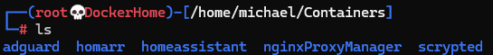

# XCP-NG Tools and Server Setup Script

This script automates the installation of XCP-NG Tools and standard server tools on various Linux distributions. It also provides an option to change the hostname and clone a dotfiles repository.

## Features

- Installs XCP-NG Tools on Debian, Ubuntu, Red Hat, Arch, and SUSE based systems.
- Installs standard server tools (`net-tools`, `cockpit`, `htop`) on Debian, Ubuntu, Red Hat, Arch, and SUSE based systems.
- Option to change the hostname.
- Installs Dotfiles to make your shell look like the example below.
   

## Usage

1. **Clone the Repository:**

   ```bash
   git clone https://github.com/Narehood/VM-Setup
   cd VM-Setup

2. **Run The Script:**

   ```bash
   bash serverSetup.sh

# Script Details
## XCP-NG Tools Installation
The script first asks if you want to install XCP-NG Tools. If you choose 'Y' “yes”, it will detect your Linux distribution and install the appropriate packages. If you are not using XCP-NG as your hypervisor select 'N'

## Standard Server Tools Installation
The script then installs standard server tools (net-tools, cockpit, htop) based on your Linux distribution.

## Change Hostname
The script provides an option to change the hostname of your system. If you choose “yes”, you will be prompted to enter the new hostname.

## Clone Dotfiles Repository
Finally, the script installs a dotfiles config and runs its installation script to customize your shell.

<br /><br /><br />
## Credit/License

### License
This project is licensed under the MIT License - see the LICENSE file for details.
### Contributing
Feel free to submit issues or pull requests if you have any improvements or suggestions.
### Acknowledgments
Thanks to the open-source community for providing the tools and resources used in this script.
